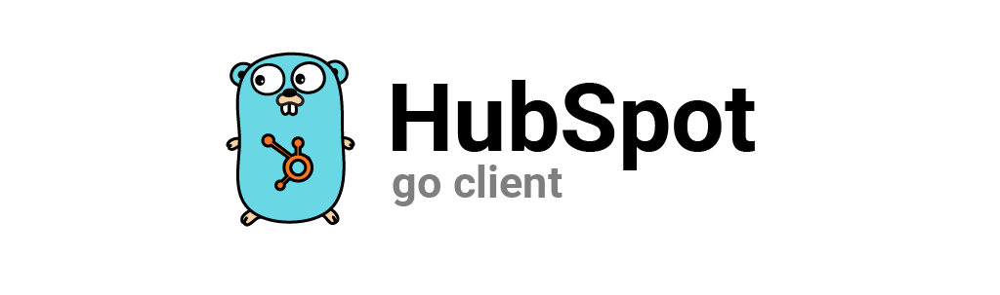

This is a HubSpot Go client generated using [openapi-generator](https://github.com/OpenAPITools/openapi-generator). It includes packages for every OpenAPI spec listed in HubSpot's API [directory](https://api.hubspot.com/api-catalog-public/v1/apis).

## Installing
```shell
go get github.com/clarkmcc/go-hubspot
```

## Re-generating Clients
This package includes a client generator that runs the `openapi-generator` binary (must be located in your PATH) and re-generates the Go clients using the most up-to-date API specs. Any changes to the specs should be committed to this repository through a PR. I'll do my best to keep this up to date with the most recent changes. Assuming that you have `openapi-generator` installed, just run the following to re-generate the clients.

```shell
go generate
```

## Using the clients
The clients are broken out into their own packages by name and categorized by API version.
```go
import "github.com/clarkmcc/go-hubspot/generated/v3/contacts"

client := contacts.NewAPIClient(contacts.NewConfiguration())

input := contacts.SimplePublicObjectInput{
  Properties: map[string]string{
    "firstname": "Adrian", 
    "lastname": "Mott",
  },
}

client.BasicApi.
    Create(context.Background()).
    SimplePublicObjectInput(input).
    Execute()
```

## Authorization
Authorization is done by passing context values in with each request. In order to facilitate this, I've created a simple `Authorizer` interface and a private app token implementation (more implementations to come). An API key implementation is also available but the HubSpot API has [deprecated API tokens](https://developers.hubspot.com/changelog/upcoming-api-key-sunset#:~:text=When%20is%20this%20change%20happening,API%20keys%20to%20be%20created).
```go
authorizer := hubspot.NewTokenAuthorizer("<PRIVATE APP TOKEN>")
ctx := hubspot.WithAuthorizer(context.Background(), authorizer)
// Pass this context to your hubspot API requests
```